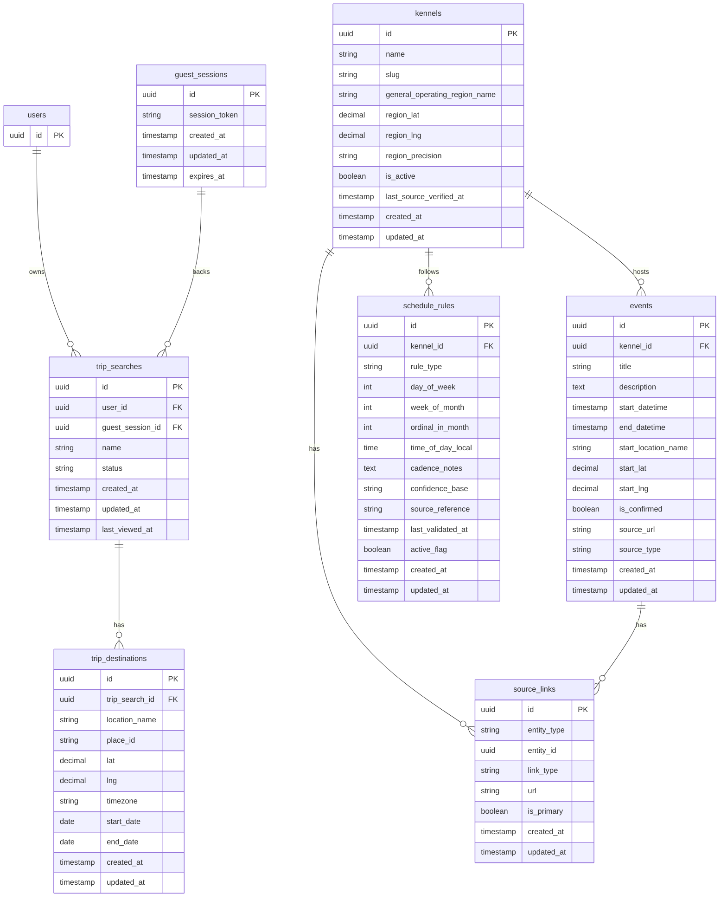

# Travel Mode MVP Data Model & ERD

## 1. Purpose
This document defines the MVP data model for Travel Mode and provides an ERD-oriented view of the entities, relationships, and key field recommendations needed to support implementation.

It is designed to complement:
- PRD v5
- Technical Build Spec

## 2. Design Principles
- Optimize for a single-destination MVP while keeping the model extensible
- Treat Travel Mode saves primarily as saved searches, not static itineraries
- Keep computed travel results derivable from source data rather than storing them as the source of truth
- Separate durable source entities (Kennel, Event, ScheduleRule) from request-time derived entities (ComputedTravelResult)
- Support both guest-session and authenticated flows

## 3. Entity Overview

### Durable / Persisted Entities
- `users`
- `trip_searches`
- `trip_destinations`
- `kennels`
- `events`
- `schedule_rules`
- `source_links` (optional normalization)
- `guest_sessions` (optional, depending on stack/session architecture)

### Derived / Non-Authoritative Entities
- `computed_travel_results` (usually computed at query time, not persisted)
- `travel_result_snapshots` (optional future enhancement)

## 4. Recommended Tables

## 4.1 users
Existing product user table. Included here only for relationship clarity.

### Key fields
- `id` UUID / PK
- other existing auth/profile fields

### Notes
- A user can own many `trip_searches`

---

## 4.2 guest_sessions
Optional table if guest state needs to be tracked server-side beyond client-only session storage.

### Purpose
Represents a non-authenticated user session that may temporarily hold Travel Mode search state before conversion.

### Fields
- `id` UUID / PK
- `session_token` string / unique
- `created_at` timestamp
- `updated_at` timestamp
- `expires_at` timestamp nullable

### Notes
- Only needed if guest search persistence is server-backed
- If session state lives entirely in client cookies/local storage, this table may not be required

---

## 4.3 trip_searches
Represents a saved Travel Mode search, or temporary search state if the app persists guest-side/server-side records.

### Purpose
Stores the durable definition of a user’s Travel Mode query.

### Fields
- `id` UUID / PK
- `user_id` UUID / FK to `users.id` / nullable
- `guest_session_id` UUID / FK to `guest_sessions.id` / nullable
- `name` string
- `status` string / nullable / recommended enum:
  - `active`
  - `archived`
- `created_at` timestamp
- `updated_at` timestamp
- `last_viewed_at` timestamp nullable

### Required constraints
- at least one of `user_id` or `guest_session_id` may be populated if guest persistence is supported
- for authenticated saved searches, `user_id` should be non-null
- for MVP product behavior, one `trip_search` should have one active `trip_destination` used in UI

### Notes
- This is conceptually “saved search” despite the `trip_searches` naming
- `name` can be auto-generated in MVP, e.g. “Chicago · Jun 14–17”
- if guest records are not persisted server-side, guest-created transient searches may never be inserted here until auth/save

---

## 4.4 trip_destinations
Stores the destination and date window for a Travel Mode search.

### Purpose
Defines the normalized travel query inputs.

### Fields
- `id` UUID / PK
- `trip_search_id` UUID / FK to `trip_searches.id`
- `location_name` string
- `place_id` string nullable
- `lat` decimal
- `lng` decimal
- `timezone` string nullable
- `start_date` date
- `end_date` date
- `created_at` timestamp
- `updated_at` timestamp

### Required constraints
- `end_date >= start_date`
- one-to-many relationship from `trip_searches` to `trip_destinations`
- MVP application layer should enforce exactly one active destination per search

### Notes
- Keeping this separate from `trip_searches` makes future multi-destination support easier
- even in MVP, this separation helps preserve a clean search-vs-destination model

---

## 4.5 kennels
Represents a kennel/community that may have confirmed events and/or recurring schedule rules.

### Purpose
Core source entity for confirmed and likely activity.

### Fields
- `id` UUID / PK
- `name` string
- `slug` string / unique nullable
- `general_operating_region_name` string nullable
- `region_lat` decimal nullable
- `region_lng` decimal nullable
- `region_precision` string nullable / recommended enum:
  - `exact`
  - `regional`
  - `broad`
- `is_active` boolean default true
- `last_source_verified_at` timestamp nullable
- `created_at` timestamp
- `updated_at` timestamp

### Optional denormalized source fields
If source links are not normalized:
- `website_url` string nullable
- `facebook_url` string nullable
- `hashrego_url` string nullable

### Notes
- `region_precision` is important for ranking/demotion logic
- `last_source_verified_at` can feed confidence logic

---

## 4.6 source_links
Optional normalized table for kennel and event outbound links.

### Purpose
Stores official or semi-official verification links.

### Fields
- `id` UUID / PK
- `entity_type` string / recommended enum:
  - `kennel`
  - `event`
- `entity_id` UUID
- `link_type` string / recommended enum:
  - `website`
  - `facebook`
  - `hashrego`
  - `instagram`
  - `other`
- `url` string
- `is_primary` boolean default false
- `created_at` timestamp
- `updated_at` timestamp

### Notes
- For MVP, you may skip normalization and keep source URLs directly on `kennels` and `events`
- Normalization is cleaner if multiple sources per entity are common

---

## 4.7 events
Represents a confirmed or posted event.

### Purpose
Provides authoritative event-level activity for Travel Mode confirmed results.

### Fields
- `id` UUID / PK
- `kennel_id` UUID / FK to `kennels.id`
- `title` string
- `description` text nullable
- `start_datetime` timestamp
- `end_datetime` timestamp nullable
- `start_location_name` string nullable
- `start_lat` decimal nullable
- `start_lng` decimal nullable
- `is_confirmed` boolean default true
- `source_url` string nullable
- `source_type` string nullable
- `created_at` timestamp
- `updated_at` timestamp

### Recommended indexes
- index on (`start_datetime`)
- index on (`kennel_id`, `start_datetime`)
- optional geospatial index on coordinates if supported by stack/database

### Notes
- Travel Mode should surface events in-window as `confirmed`
- `source_url` may duplicate `source_links`; MVP can tolerate this

---

## 4.8 schedule_rules
Represents a known recurring pattern for a kennel.

### Purpose
Supports derivation of likely or possible Travel Mode results.

### Fields
- `id` UUID / PK
- `kennel_id` UUID / FK to `kennels.id`
- `rule_type` string / recommended enum examples:
  - `weekly_day_of_week`
  - `monthly_nth_weekday`
  - `monthly_loose_weekend`
  - `custom_notes`
- `day_of_week` integer nullable
- `week_of_month` integer nullable
- `ordinal_in_month` integer nullable
- `time_of_day_local` time nullable
- `cadence_notes` text nullable
- `confidence_base` string nullable / recommended enum:
  - `high`
  - `medium`
  - `low`
- `source_reference` string nullable
- `last_validated_at` timestamp nullable
- `active_flag` boolean default true
- `created_at` timestamp
- `updated_at` timestamp

### Notes
- Not every rule type will use every date-part column
- `confidence_base` is an input to computed confidence, not necessarily final displayed confidence
- `source_reference` may point to a source doc, crawl artifact, or notes field

### Recommended indexes
- index on (`kennel_id`, `active_flag`)
- index on (`confidence_base`)
- index on (`last_validated_at`)

---

## 4.9 computed_travel_results
This is generally a service-layer shape, not a persisted table.

### Purpose
Represents the merged output returned to the Travel Mode UI.

### Recommended response fields
- `result_id`
- `result_type`:
  - `confirmed`
  - `likely`
  - `possible`
- `kennel_id`
- `event_id` nullable
- `trip_search_id` nullable
- `display_title`
- `relevant_date` nullable
- `timing_text`
- `confidence_level` nullable
- `distance_miles` nullable
- `distance_tier`
- `explanation_text`
- `source_links` array
- `region_match_precision`
- `sort_bucket`
- `sort_date`

### Notes
- This should usually be computed on demand from `trip_destinations`, `events`, `kennels`, and `schedule_rules`
- Avoid making this table authoritative in MVP unless performance forces caching

---

## 4.10 travel_result_snapshots (future / optional)
Not needed for MVP, but useful if you later want diffing or “what changed since I last looked?”

### Potential fields
- `id` UUID / PK
- `trip_search_id` UUID / FK
- `computed_at` timestamp
- `result_payload` JSONB
- `result_counts` JSONB

### Notes
- Optional future enhancement only
- Could power change detection, notifications, or historical auditing

## 5. Relationship Summary

### Core relationships
- one `user` to many `trip_searches`
- one `guest_session` to many `trip_searches` (optional)
- one `trip_search` to many `trip_destinations`
- one `kennel` to many `events`
- one `kennel` to many `schedule_rules`
- one `kennel` to many `source_links` if normalized
- one `event` to many `source_links` if normalized

### MVP practical relationship assumptions
- one Travel Mode search behaves as one destination in product UX
- one kennel can have many schedule rules
- one kennel can have zero or many future confirmed events
- a computed result may reference either:
  - an `event` for confirmed results
  - a `schedule_rule`-driven derived output for likely/possible results

## 6. ERD (Mermaid)

## 7. Schema Notes by Concern

## 7.1 Saved Search vs Trip Naming
Although product copy may say “Save Trip” or “Save Search,” the schema should reflect actual behavior:
- saved query criteria
- refreshed results on revisit
- not a static itinerary snapshot

`trip_searches` is a reasonable table name because it preserves product context while still reflecting saved search behavior.

## 7.2 Why `trip_destinations` exists separately
Even though MVP only supports one destination:
- it keeps search metadata separate from destination inputs
- it preserves a clean path to multi-stop expansion later
- it avoids stuffing date/location fields directly into `trip_searches`

## 7.3 Why computed results should stay derived
Confirmed, likely, and possible results are all downstream of:
- search inputs
- current confirmed events
- current schedule rules
- ranking logic

Storing them as the main source of truth would create sync complexity too early.

## 7.4 Why `region_precision` matters
This field supports product and ranking needs:
- broad/low-precision matches should be demoted
- sparse-market areas may still allow broader inclusion
- dense markets can be more selective

## 8. Suggested Constraints & Validation Rules

### trip_searches
- prevent orphaned records without owner/session if persistence requires ownership
- optional check: not both `user_id` and `guest_session_id` null
- optional app-level rule: once a guest converts, guest-owned search migrates to `user_id`

### trip_destinations
- validate `end_date >= start_date`
- validate coordinates present after successful geocoding
- consider uniqueness rule if you want only one destination row per search in MVP

### events
- validate `start_datetime` present
- validate `kennel_id` present
- if coordinates exist, both lat/lng should generally exist together

### schedule_rules
- validate `kennel_id` present
- validate `rule_type` present
- app-level validation should ensure the relevant columns for each `rule_type` are populated

## 9. Suggested Indexes

### trip_searches
- index on (`user_id`, `created_at desc`)
- index on (`guest_session_id`) if guest persistence is used

### trip_destinations
- index on (`trip_search_id`)
- optional geospatial index on (`lat`, `lng`) if searching persisted destinations frequently

### kennels
- index on (`is_active`)
- optional geospatial index on (`region_lat`, `region_lng`)

### events
- index on (`start_datetime`)
- index on (`kennel_id`, `start_datetime`)
- optional geospatial index on (`start_lat`, `start_lng`)

### schedule_rules
- index on (`kennel_id`, `active_flag`)
- index on (`confidence_base`)
- index on (`last_validated_at`)

### source_links
- index on (`entity_type`, `entity_id`)
- index on (`link_type`)

## 10. Suggested Migration Strategy

### Phase 1: Travel Search Persistence
Create:
- `trip_searches`
- `trip_destinations`

Only if needed:
- `guest_sessions`

### Phase 2: Kennel Scheduling Support
Create or extend:
- `schedule_rules`

Add/confirm on `kennels`:
- region fields
- precision field
- source verification timestamp

### Phase 3: Source Link Normalization (Optional)
Create:
- `source_links`

This can be deferred if existing source URLs already live on `kennels` and `events`.

## 11. Example Minimal MVP Schema Decision
If you want the leanest possible MVP schema, you could implement with:

### Required
- `trip_searches`
- `trip_destinations`
- `schedule_rules`

### Reused existing
- `users`
- `kennels`
- `events`

### Deferred
- `guest_sessions`
- `source_links`
- `travel_result_snapshots`

That would likely be enough to ship the feature if your current platform already has user/session handling and source URLs on existing entities.

## 12. Open Schema Questions
- Should guest searches be persisted server-side, or only after auth?
- Do existing `kennels` and `events` tables already store enough source-link information?
- Does `schedule_rules` need a more structured recurrence representation, or is MVP rule typing enough?
- Do you want a hard database constraint enforcing one destination per `trip_search` for MVP, or only app-layer enforcement?
- Will you eventually want result snapshots for “what changed?” UX?

## 13. Recommendation
For MVP, I recommend:
1. keep `trip_searches` + `trip_destinations` as the new core persisted Travel Mode tables
2. extend `kennels` and `schedule_rules` enough to support region precision and confidence inputs
3. compute Travel Mode results dynamically rather than persisting result rows
4. defer snapshotting and heavy normalization unless implementation complexity stays low
